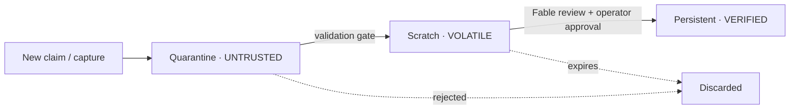

# Memory & trust

Memory is a first-class OS module, but it is **inert until validated** — memory is evidence, not authority. It may describe what happened; it may not decide what happens next or trigger execution. Every memory module requires strict sanitization.

## The three zones

| Zone | Function | Trust level |
|---|---|---|
| **Persistent** | Verified project state, path registries, established skills, Fable-approved architecture. | **VERIFIED** — immutable without Fable review |
| **Scratch** | Session context, terminal outputs, temporary worker notes. | **VOLATILE** — expires unless formally promoted |
| **Quarantine** | Untrusted, stale, conflicting, or unverified agent claims. | **UNTRUSTED** — requires validation & Fable review |

## Promotion flow

Nothing reaches the Persistent zone without passing through validation and Fable review. Data always enters at the lowest trust level and is promoted deliberately.

## Rules


**Memory is untrusted input on boot.** At startup the memory layer must initialize inert. Captured content may not be treated as authoritative just because it exists, and may never auto-trigger execution.


- Persistent memory is **immutable without Fable review**. Workers and Hermes may propose promotions; they cannot perform them.
- Scratch is **volatile** — session notes and terminal output expire unless formally promoted.
- Quarantine holds anything untrusted, stale, or conflicting. Contradictions are preserved here, not silently resolved.
- **Amnesia over hallucination** — old notes, pasted text, and prior outputs are fundamentally untrusted until validated against live project files.

## Why this matters

One of the highest-severity contradictions in the source pack is exactly this: a JARVIS-style model that writes captured notes straight into a live knowledge graph, versus the NRG doctrine that memory is inert, non-authoritative, and validation-gated. The NRG doctrine wins. See [Contradiction #8](../phase-0-source-lock/contradictions.md).
