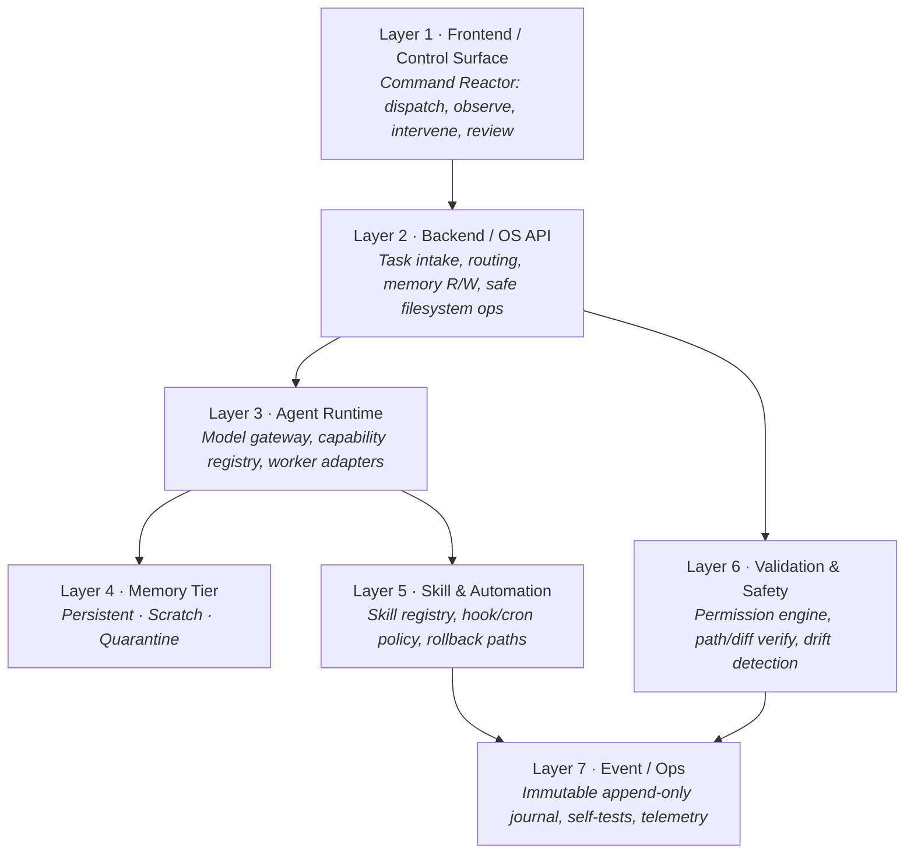

# System layers

NRG Agent OS is designed as a modular hierarchy. Each layer has a strict responsibility and a strict boundary; nothing above may reach past its contract into the layers below.

## The layers

<table data-view="cards">
  <thead><tr><th></th><th></th></tr></thead>
  <tbody>
    <tr><td><strong>1 · Frontend / Control Surface</strong></td><td>An operational Command Reactor for telemetry, logs, operating modes, and validation indicators. Terminal functions: dispatch, observe, intervene, review. Failures and blockers must be highly visible.</td></tr>
    <tr><td><strong>2 · Backend / OS API</strong></td><td>Strictly typed endpoints governing task intake, routing protocols, memory read/write, validation, and filesystem security boundaries.</td></tr>
    <tr><td><strong>3 · Agent Runtime</strong></td><td>Hermes integration, model gateway (local/cloud balancing), capability registry, and worker execution adapters.</td></tr>
    <tr><td><strong>4 · Memory Tier</strong></td><td>Strict data isolation splitting context across Persistent, Scratch, and Quarantine zones. See <a href="memory-and-trust.md">Memory &#x26; trust</a>.</td></tr>
    <tr><td><strong>5 · Skill &#x26; Automation</strong></td><td>Modular registry of declarative, verified operational profiles, plus hook/cron policy, approval gates, and automated rollback paths.</td></tr>
    <tr><td><strong>6 · Validation &#x26; Safety</strong></td><td>Permission engine, path/diff verification, drift and hallucination detection, and destructive-action blockers.</td></tr>
    <tr><td><strong>7 · Event / Ops</strong></td><td>Immutable, append-only systemic journal capturing every environment operation, plus OS self-tests and failure telemetry.</td></tr>
  </tbody>
</table>


An eighth concern — the **Design System** — runs across the control surface: codified UI components that communicate status, risk, and recovery parameters. See [Design system](../console/design-system.md).


## Layer discipline


**Armor is built before automation.** The Kernel (boot rules, permissions, task lifecycle) and Validation layers must exist and be proven before the Skill/Automation layer is trusted to act, and long before the Control Surface is built. Building the dashboard first is the single most-flagged failure mode in the source pack.


The order in which these layers come into existence is fixed — see the [Build sequence](build-sequence.md).
