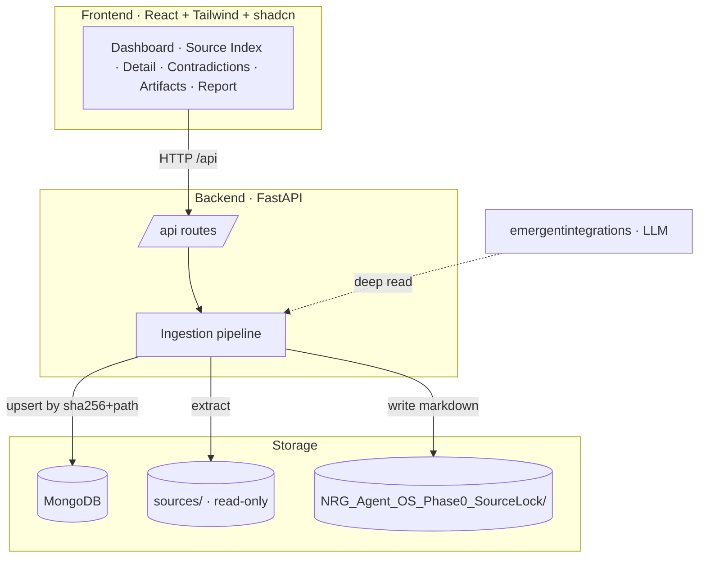

# Architecture

The Console is a full-stack app: a **FastAPI + MongoDB** backend running the ingestion pipeline, and a **React** control surface for the operator. LLM deep-read runs through the `emergentintegrations` gateway.

## Backend modules

| Module | Responsibility |
|---|---|
| `server.py` | FastAPI app, `/api` router, Mongo client, run orchestration. |
| `extraction.py` | Enumerate files, extract text (PDF + MD), compute SHA-256. |
| `classification.py` | Authority tier, tags, priority order, forbidden-build-area rules. |
| `analysis.py` | LLM deep-read (summary + key claims) and contradiction detection. |
| `artifacts.py` | Render the five Phase 0 markdown artifacts. |
| `doctrine.py` | The doctrine constants that keep classification deterministic. |

## Data model



`path`, `filename`, `ext`, `sha256`, `size`, `extracted_text` (preview + full), `authority_tier`, `tags[]`, `priority_rank`, `summary`, `key_claims[]`, `parse_status`.



`id`, `sources_involved[]`, `conflicting_claims`, `resolution`, `status = PRESERVED`, `notes`.



`runs`: ingestion status, timestamps, counts, errors. `state`: `scope_lock` flag and the operator-acceptance record that freezes Phase 0.



## API routes

All routes are served under the `/api` prefix.

| Method | Route | Purpose |
|---|---|---|
| `GET` | `/status` | Current run + system state. |
| `POST` | `/ingest` | Start an ingestion run. |
| `GET` | `/ingest/status` | Poll ingestion progress. |
| `GET` | `/sources` | List/search sources (filter by tier, tags, priority). |
| `GET` | `/sources/{source_id}` | Full metadata, text, summary, key claims. |
| `GET` | `/contradictions` | The preserved contradictions register. |
| `GET` | `/priority` | The priority order and rank assignments. |
| `GET` | `/artifacts` | List generated artifacts. |
| `GET` | `/artifacts/{name}` | Render a single artifact as markdown. |
| `GET` | `/report` | The completion report. |
| `POST` | `/operator/accept` | Record acceptance and freeze state into WAIT mode. |

## Pipeline properties


**Idempotent by design.** Ingestion upserts by `sha256 + path`, so re-running a bundle never duplicates records. Large extracted text is stored as preview + full field so the UI stays responsive. After acceptance, Phase 0 state is frozen and cannot change accidentally.

