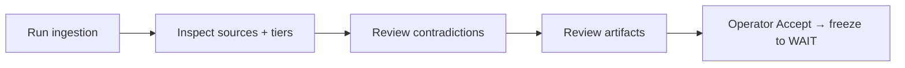

# The Console

The **Phase 0 Source Lock Console** is the full-stack application that performs Phase 0: it ingests the source bundle, extracts and hashes every file, classifies each by authority and priority, runs LLM deep-read analysis, preserves contradictions, and generates the [Phase 0 artifacts](../phase-0-source-lock/overview.md) — then holds for operator acceptance.


The Console is deliberately scoped. It is **for indexing, analysis, artifact generation, and operator acceptance only.** It builds no Kernel, Memory, Router, Workers, or live-operation components — the [Scope lock](../phase-0-source-lock/scope-lock.md) applies to the tooling as much as the doctrine.


## What the operator can do

<table data-view="cards">
  <thead><tr><th></th><th></th></tr></thead>
  <tbody>
    <tr><td><strong>Run ingestion</strong></td><td>Kick off the pipeline from the UI and watch progress to completion.</td></tr>
    <tr><td><strong>Inspect sources</strong></td><td>Browse a searchable index with authority tiers, tags, and priority ranks; open any source for metadata, extracted text, summary, and key claims.</td></tr>
    <tr><td><strong>Review contradictions</strong></td><td>See preserved conflicts with the involved sources and the resolution rule.</td></tr>
    <tr><td><strong>Read artifacts</strong></td><td>View and download the five generated Phase 0 markdown artifacts.</td></tr>
    <tr><td><strong>Accept &#x26; freeze</strong></td><td>Record operator acceptance, which freezes Phase 0 state into WAIT mode.</td></tr>
  </tbody>
</table>

## The north-star flow

## Brand attributes

The Console is **forensic, disciplined, mission-control, and operator-first** — high-signal, low-noise, and explicitly *not* cinematic (not JARVIS). See [Architecture](architecture.md) for how it is built and [Design system](design-system.md) for how it looks.
