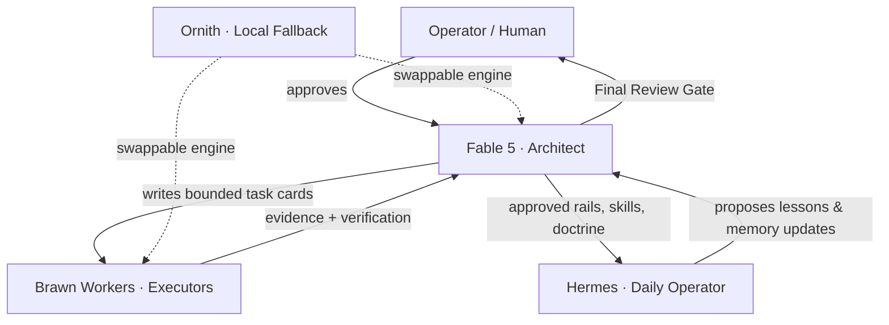

# Roles & the Barbell

The OS operates on a strict asymmetric routing doctrine — **the Barbell Method**. Intelligence is segmented by cost, capability, and risk: reserve the expensive architect brain for planning, diagnosis, judging, and skill-carving, and route grunt work to cheaper models.

## The four nodes

| Node | Designation | Operational boundary |
|---|---|---|
| **Fable 5** | The Architect | Owns OS layout, prompt systems, router logic, persistent memory, permission models, validation, and the Final Review Gate. Writes task cards. |
| **Brawn Workers** | The Executors | Support models (Codex, GPT-5.5, Gemini 3.5). Execute strict Fable task cards. **Cannot** invent architecture, alter permissions, expand scope, or touch forbidden files. |
| **Hermes** | Daily Operator | Runs inside the structured OS. Executes approved skills, captures session summaries, proposes memory updates. **Cannot** alter core prompts or unilaterally promote memory. |
| **Ornith** | Local Fallback | Optional, swappable local model behind the gateway. Ensures the OS is never vendor-locked. |

## How authority flows

## Boundary rules


**Authority does not launder through usefulness.** A worker producing a useful suggestion does not gain permission to act on it. Hermes proposing a good lesson does not get to promote it into memory. Only Fable's review — under operator approval — moves anything into the permanent lawbook.


- **Fable owns design.** Architecture, folder structure, memory layout, and task-card generation belong to Fable. It designs durable contracts, not one-off freestyle execution.
- **Workers execute bounded chores only** after Fable provides an exact task card with file boundaries and acceptance criteria. See [Worker task cards](../architecture/worker-task-cards.md).
- **Hermes benefits from the rails** Fable builds; it does not govern Fable.
- **Merge, don't rebuild.** Every role preserves existing pieces and stitches them into the operator workflow rather than rewriting working components.
