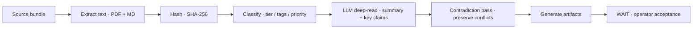

# Phase 0 — Source Lock

Phase 0 is the first and **only currently authorized** phase. Its job is to convert a messy pile of source material into a source-locked foundation: every file indexed and classified, every contradiction preserved, and a completion report that hands the operator a clean decision point.


**Doctrine.** Control files tell Fable what to do. Primary sources tell Fable what the project is. Reference sources explain how the thinking evolved. Concept-only files inspire later design but cannot authorize build decisions.


## What Phase 0 produces

<table data-view="cards">
  <thead><tr><th></th><th></th><th data-hidden data-card-target data-type="content-ref"></th></tr></thead>
  <tbody>
    <tr><td><strong>Source index</strong></td><td>All 37 sources with authority tier, priority, tags, hash, and parse status.</td><td><a href="source-index.md">source-index.md</a></td></tr>
    <tr><td><strong>Source priority</strong></td><td>The 1–11 priority order and the rank assignment for every file.</td><td><a href="source-priority.md">source-priority.md</a></td></tr>
    <tr><td><strong>Contradictions register</strong></td><td>12 preserved conflicts with severity and resolution under Master Build Law.</td><td><a href="contradictions.md">contradictions.md</a></td></tr>
    <tr><td><strong>Scope lock</strong></td><td>The forbidden build areas and the Phase 0 boundary.</td><td><a href="scope-lock.md">scope-lock.md</a></td></tr>
    <tr><td><strong>Completion report</strong></td><td>Counts, failures, and the operator acceptance gate.</td><td><a href="completion-report.md">completion-report.md</a></td></tr>
  </tbody>
</table>

## The pipeline

## Status at a glance

| Metric | Value |
|---|---|
| Sources indexed | **37** |
| Parsed successfully | **37 / 37** |
| Contradictions preserved | **12** |
| Extraction failures | None |
| State | **Complete — awaiting operator acceptance** |


Phase 0 ends when the operator accepts the [Completion report](completion-report.md). The system then freezes its Phase 0 outputs and enters **WAIT mode**, taking no further action until commanded. Nothing outside the Phase 0 boundary may be built — see [Scope lock](scope-lock.md).

