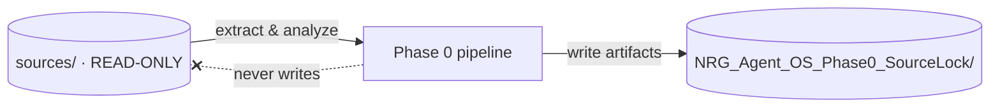

# Scope lock

This workspace is authorized for **Phase 0 Source Lock only**: source indexing, classification, contradiction preservation, and completion reporting. Nothing else.

## Forbidden build areas


The following are **not** to be implemented during Phase 0:


| Component | Status |
|---|---|
| Kernel | ❌ Forbidden |
| Memory | ❌ Forbidden |
| Router | ❌ Forbidden |
| Validation | ❌ Forbidden |
| Audit | ❌ Forbidden |
| Workers | ❌ Forbidden |
| Skills | ❌ Forbidden |
| Recovery | ❌ Forbidden |
| UI (OS control surface) | ❌ Forbidden |
| Controlled Live Operation | ❌ Forbidden |

## Folder discipline

- The source folder is **READ-ONLY**. Sources are never modified.
- Phase 0 artifacts are written **only** inside the approved workspace root: `NRG_Agent_OS_Phase0_SourceLock`.

## Exit condition


Phase 0 ends when the operator accepts the [Completion report](completion-report.md). The system then enters **WAIT mode** and takes no further action until commanded. No later phase — including Phase 1 Kernel — may begin without an explicit command.

