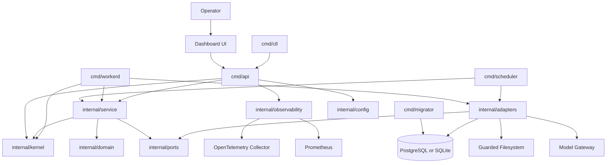
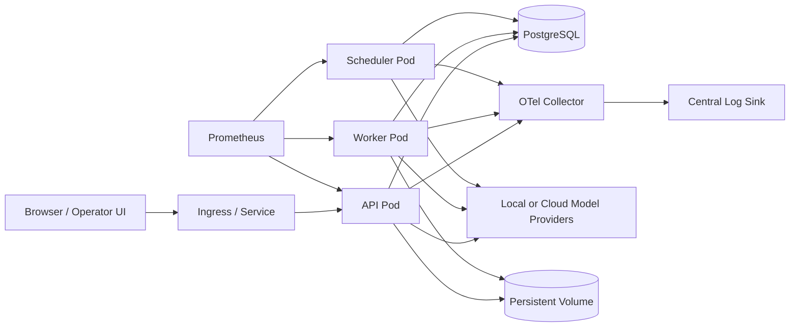

# Production-Ready Go Blueprint for NRG Agent OS

## Executive summary

I inspected the uploaded ZIP directly. It contains one archive with **32 source files** made up of PDFs and Markdown artifacts, not a runnable codebase. The corpus is rich in governance, role definitions, safety rules, memory concepts, dashboard ideas, prompt scaffolds, archive reports, and architectural sequencing, but it does **not** include a confirmed repository baseline, concrete existing Go code, a locked deployment target, a final database choice, a production identity provider, performance SLOs, or an agreed UI implementation stack. Those items are therefore treated below as **unspecified assumptions** and called out explicitly where relevant.

The corpus is internally consistent on the points that matter most: the system is **kernel-first**, **model-agnostic**, **local-first**, **full-stack**, and **safety-biased**; **Fable** is the architect and review gate; **Hermes** is the bounded in-OS runtime operator; **workers** execute tightly scoped task cards only; **memory is first-class but not authority**; and **self-evolution must be gated by validation, quarantine, review, and rollback**. That makes a **modular monolith in one Go repository** the best starting point: it keeps governance centralized, reduces coordination overhead, matches the current maturity of the corpus, and follows Go guidance that a single module at the repository root is the simplest source layout when independent versioning is not yet required. citeturn1search5turn1search2turn21search2

The recommended implementation is a **single Go module** at the repo root, targeting **Go 1.26** with the `toolchain` line pinned to a current patch release, because as of the current official release history, Go 1.26.0 was released on February 10, 2026 and Go 1.26.4 on June 2, 2026, and the Go project supports each major release until there are two newer major releases. citeturn20view2turn19search1turn3search11

The tactical architecture is this:

- **Go control-plane API** using the standard library `net/http` router by default, because Go 1.22+ added method-aware routing and path wildcards, reducing the need for a third-party router in many services. citeturn12search0turn12search1
- **Go worker runtime** as a separate binary that executes bounded, validated task cards only.
- **Go scheduler** for timed automations and queue dispatch.
- **PostgreSQL in production** and **SQLite in local development** unless the user later supplies a locked database requirement. This is an explicit design recommendation, not a source fact.
- **Structured logging with `log/slog`** by default, because it is in the Go standard library and designed for structured key-value logging. citeturn3search0turn3search1
- **Prometheus metrics** with `client_golang` and `promhttp`, and **OpenTelemetry traces** exported to an **OpenTelemetry Collector**, because the OpenTelemetry documentation explicitly recommends sending telemetry to the Collector in production. citeturn9search0turn9search1turn9search3turn8search10turn8search15
- **Kubernetes Deployment + Helm chart** as the canonical production deployment path, with ConfigMaps for non-secret config, Secrets for secret material, health probes, rolling updates, and Helm upgrade/rollback as the standardized release mechanism. citeturn6search0turn6search4turn6search6turn6search14turn6search7turn24search0turn6search1

The result is a production-ready Go project that preserves the corpus’ governance spine while translating it into buildable software: **kernel → memory → router → validation → workers → Hermes runtime → dashboard → automations**, with every mutation path subject to evidence, approval, observability, and rollback.

### Source inventory and how each artifact is incorporated

The table below inventories **every provided source artifact** and shows how it influences the design.

| Provided element | Type | Incorporated as |
|---|---:|---|
| `Architecting the NRG Agent OS - Google Gemini.pdf` | PDF | Kernel-first governance, boot sequencing, command-surface concepts, Fable review gate |
| `Boot Sequence Design.pdf` | PDF | Boot phases, evidence-before-authority rule, integrity testing, startup law |
| `concept designs - Agent OS Design Principles.pdf` | PDF | Full-stack agent OS principles, drift/hallucination detection, router and automation concepts |
| `concept designs - Combine Plan Optimization.pdf` | PDF | Merged architecture, Hermes bounded runtime, worker discipline, validation-centered planning |
| `concept designs - Final Fable Handoff.pdf` | PDF | Final handoff constraints, design-vs-runtime role separation |
| `concept designs - Memory Integration and Planning.pdf` | PDF | Persistent/scratch/quarantine memory model and memory promotion gates |
| `concept designs - NRG Agent OS Overview.pdf` | PDF | Dashboard panel taxonomy, operating modes, workflow references, role definitions |
| `concept designs - NRG Agent OS Workflow.pdf` | PDF | Control-problem framing, distilled execution flow |
| `concept designs - Review Request.pdf` | PDF | Explicit anti-slop requirement, repeated review discipline, contradiction resolution |
| `concept designs - Startup Prompt Creation.pdf` | PDF | Startup-context loading expectations and project-entry assumptions |
| `concept designs - Startup Prompt Instructions.pdf` | PDF | Intake pattern for messy source packs, dashboard panel expectations |
| `concept designs jarvis style  - Final Fable Handoff.pdf` | PDF | JARVIS-derived experience features treated as inspiration only |
| `Dashboard OS Agent Framework Setup - Google Gemini.pdf` | PDF | Agent registry scaffold, orchestration directories, UI/data agent split ideas |
| `deep-research-report.md` | Markdown | Existing source-pack assessment; used as a normalized secondary distillation |
| `DISTILL 7 FOLD!.md` | Markdown | Fable forensic loop, barbell routing, merge-don’t-rebuild doctrine |
| `End Of Source Conversation.pdf` | PDF | Final corrected intent and priority order |
| `Fable 5 Model Behavioural Biopsy - Google Gemini.pdf` | PDF | Fable’s strengths/limits, review-role framing, barbell dispatch pattern |
| `Fable 5 OS Design Blueprint - Google Gemini.pdf` | PDF | Fable method, durable rails, operational UI emphasis |
| `Fable Pack Feedback.pdf` | PDF | Warning against giant super-prompts; push toward kernel + skill + task card artifacts |
| `JARVIS-Prompt-Pack.pdf` | PDF | Optional inspiration only; explicitly not architectural authority |
| `NRG Agent OS Dashboard Information Pack Assessment.pdf` | PDF | Independent assessment of pack maturity, panel set, risk areas, roadmap clues |
| `NRG Agent OS Factory Pack.pdf` | PDF | Explicit factory-pack artifact structure and build-order expectations |
| `NRG Agent OS Source Intake Prompt.pdf` | PDF | Source-lock discipline, contradiction handling, preserve-latest-intent rule |
| `NRG-Agent-OS - Agent Rules - XML Behavioral Framework.md` | Markdown | XML-tag prompt skeleton and behavioral contract structure |
| `NRG-Agent-OS - Fable-5 Master Intake Pack - Copy 01.md` | Markdown | Architect role, barbell doctrine, core kernel and safety constraints |
| `NRG-Agent-OS - Fable-5 Master OS Architecture Intake.md` | Markdown | Surgical blueprint expectation, no-invention rule, build order |
| `NRG-Agent-OS - Phase 0 System State - Source Lock - Copy 01.md` | Markdown | Phase 0 status model, readonly startup state, immediate block targets |
| `NRG-Agent-OS - Project Manifest.md` | Markdown | Layer model and “OS is the asset” principle |
| `NRG-Agent-OS - Skill - fable.forensic-methodology.md` | Markdown | Reusable architect methodology implemented as policy and review workflow |
| `NRG-Agent-OS - Worker Task Card Template - Minimal Verification Gate.md` | Markdown | Task card schema and minimal verification gate |
| `NRG_Agent_OS_Final_Archive_Report.md` | Markdown | Most complete chronological archive and corrected intent spine |
| `user-adhd-communication-style.md` | Markdown | Requirement hygiene rule: treat brainstorms as non-final until confirmed |

### Unspecified assumptions

| Area | Status | Working assumption in this blueprint |
|---|---|---|
| Existing repository baseline | Unspecified | New repository is created from scratch |
| Cloud provider | Unspecified | Kubernetes-compatible cluster; cloud-agnostic manifests |
| Database | Unspecified | PostgreSQL in production, SQLite in local/dev |
| Message queue | Unspecified | In-process queue first, pluggable later |
| Identity provider | Unspecified | Local operator auth for MVP; OIDC-ready abstraction |
| Frontend UI stack | Unspecified | Go-served HTML templates + SSE for MVP |
| Secret manager | Unspecified | Kubernetes Secrets first; external manager pluggable |
| Model providers | Partially specified | Gateway supports cloud and local providers; exact set remains configurable |
| Compliance regime | Unspecified | OWASP ASVS + NIST SSDF as default baseline |
| Team size | Unspecified | Estimates expressed in person-weeks |

## Source-driven architecture

The uploaded corpus is strongest where software projects usually fail first: governance, boundaries, review, and failure containment. The design below keeps that intact by translating the source material into a **hexagonal, kernel-first modular monolith**. The kernel, domain rules, and validation logic stay pure Go packages with no transport or storage dependencies, while adapters handle HTTP, filesystems, model providers, SQL, telemetry, and deployments. That structure fits the corpus’s “OS is the asset” principle and Go’s module and package model. citeturn1search2turn1search5turn21search2

### Recommended architectural stance

The project should begin as a **single root Go module** with several binaries under `cmd/`, not as a multi-module workspace. Official Go guidance says that keeping a repository as a single module at the root is the simplest maintenance model, and workspaces are most useful when you are actively developing multiple modules together. Because this design is still pre-product and must keep policy, contracts, and review together, a single-module repo is the right default. citeturn1search5turn5search0turn1search0

The repository should therefore use:

- `go.mod` and `go.sum` checked into source control. citeturn1search0turn1search4
- `go 1.26.0` plus `toolchain go1.26.4` in `go.mod`, so the codebase expresses both language compatibility and the minimum preferred toolchain. citeturn20view2turn3search11
- semantic version tags `vX.Y.Z` for releases, matching Go module versioning rules. citeturn1search9turn1search8

### Option comparisons

#### HTTP routing options

| Option | Strengths | Weaknesses | Recommendation |
|---|---|---|---|
| `net/http` `ServeMux` | Built-in; Go 1.22+ supports method matching and wildcards; one fewer dependency. citeturn12search0turn12search1 | Less ergonomic route grouping and scoped middleware in large APIs | **Default choice** |
| `chi` | Lightweight, idiomatic, composable, strong fit for large REST services and middleware chains. citeturn11search0turn11search3 | Extra dependency; still relatively low-level | Fallback if route tree becomes unwieldy |
| `gin` | High productivity, built-in binding/validation examples, strong middleware ecosystem. citeturn13search0turn13search16turn13search9 | More opinionated; larger surface area than needed for a governance-first control plane | Not the first pick here |

**Decision:** start with `net/http` and only introduce `chi` if the route surface becomes painful. That matches the corpus’s minimalism and the Go team’s explicit goal of reducing router dependencies in many services. citeturn12search0turn12search1

#### Logging options

| Option | Strengths | Weaknesses | Recommendation |
|---|---|---|---|
| `log/slog` | Standard library structured logging with levels and key-value attributes. citeturn3search0turn3search1 | Lower raw throughput than specialized hot-path loggers in some workloads | **Default choice** |
| `zap` | Fast, structured, leveled logging; zero-allocation JSON encoder; stable v1 package. citeturn23view0 | More API surface; external dependency | Use behind adapter if throughput becomes critical |
| `zerolog` | JSON-focused, low-allocation structured logging, simple chaining API. citeturn23view1turn23view3 | More opinionated output model; console prettification is intentionally inefficient | Viable alternative in log-heavy services |

**Decision:** use `slog` for the first release and wrap it behind a small logger interface so the implementation can be swapped later without touching business logic. That keeps the dependency graph conservative while preserving a migration path.

#### Dependency injection options

| Option | Strengths | Weaknesses | Recommendation |
|---|---|---|---|
| Manual constructors | Explicit, idiomatic Go, zero framework lock-in | Boilerplate grows with graph size | **Default choice** |
| Wire | Compile-time DI, explicit initialization, no runtime reflection. citeturn11search2 | Adds code generation and another tool in the build chain | Introduce only if constructor graph becomes too large |
| Fx | Lifecycle-aware runtime DI, good for large service graphs. citeturn10search0turn10search3 | Heavier abstraction; more magic than needed for this codebase | Not recommended for first release |

**Decision:** manual DI first. The corpus strongly prefers explicit, inspectable rails over abstraction-heavy glue.

### Target module graph



### Package boundaries

| Boundary | Responsibility | May depend on | Must not depend on |
|---|---|---|---|
| `internal/kernel` | Operating modes, task-card law, permissions, review gates, mutation policies | `internal/domain` only | HTTP, SQL, OpenTelemetry, filesystem adapters |
| `internal/domain` | Core entities and value objects | Standard library only | Everything else |
| `internal/service` | Use cases and orchestration | `domain`, `kernel`, `ports` | Transport/storage implementations |
| `internal/ports` | Interfaces for repositories, model gateway, file guard, telemetry facade | Standard library only | Concrete implementations |
| `internal/adapters` | SQL, filesystem, model-provider, telemetry, auth, queue implementations | `ports`, stdlib, third-party libs | Higher-level API handlers |
| `internal/app` | Per-binary composition and wiring | all internal packages as needed | Nothing external to repo policy |
| `cmd/*` | Entrypoints only | `internal/app` | Business logic |

### Data model

The source corpus talks about **task cards**, **memory zones**, **review gates**, **validation**, **audit**, and **automation**. The first production-ready schema should model those directly.

| Aggregate | Core fields | Notes |
|---|---|---|
| `TaskCard` | `id`, `title`, `objective`, `mode`, `risk`, `allowed_paths`, `forbidden_paths`, `validation_profile`, `approval_required`, `created_by` | Canonical immutable work order |
| `TaskExecution` | `id`, `task_card_id`, `worker`, `status`, `started_at`, `ended_at`, `evidence_uri`, `diff_summary`, `error_code` | Runtime execution record |
| `MemoryEntry` | `id`, `zone`, `subject`, `content`, `source_kind`, `source_ref`, `trust_level`, `promoted_by`, `promoted_at`, `expires_at` | `zone` is `persistent`, `scratch`, or `quarantine` |
| `ReviewDecision` | `id`, `subject_type`, `subject_id`, `decision`, `reason`, `reviewer`, `created_at` | Used for Fable/human approval workflows |
| `ValidationRun` | `id`, `subject_type`, `subject_id`, `ruleset`, `status`, `findings_json`, `run_at` | Captures every gate result |
| `AuditEvent` | `id`, `actor`, `action`, `target`, `risk`, `result`, `trace_id`, `occurred_at` | Append-only event log |
| `AutomationRule` | `id`, `name`, `trigger`, `task_card_id`, `enabled`, `requires_approval`, `last_run_at` | No self-activation without policy |
| `ModelRouteDecision` | `id`, `request_class`, `risk`, `selected_provider`, `selected_model`, `reason`, `created_at` | Makes routing debuggable |

### Deployment topology



For production telemetry, applications should export traces and metrics to an OpenTelemetry Collector; OpenTelemetry’s Go documentation and exporter guidance describe the Collector as the best-practice production target, and the Collector docs document both gateway and agent-to-gateway deployment patterns. For this project, start with a **gateway Collector deployment** and move to **agent-to-gateway** only when cluster-wide enrichment or node-local buffering becomes necessary. citeturn8search10turn8search7turn8search2turn8search18

## Repository structure and code templates

### Exhaustive folder and file layout

```text
nrg-agent-os/
├── .dockerignore
├── .editorconfig
├── .gitignore
├── .golangci.yml
├── CHANGELOG.md
├── LICENSE
├── Makefile
├── README.md
├── go.mod
├── go.sum
├── api/
│   └── openapi/
│       └── openapi.yaml
├── cmd/
│   ├── api/
│   │   └── main.go
│   ├── ctl/
│   │   └── main.go
│   ├── migrator/
│   │   └── main.go
│   ├── scheduler/
│   │   └── main.go
│   └── workerd/
│       └── main.go
├── configs/
│   ├── config.example.yaml
│   ├── otel-collector.yaml
│   └── prometheus.yml
├── db/
│   ├── migrations/
│   │   ├── 000001_init.up.sql
│   │   ├── 000001_init.down.sql
│   │   ├── 000002_indexes.up.sql
│   │   └── 000002_indexes.down.sql
│   └── seeds/
│       └── dev_seed.sql
├── deploy/
│   ├── docker/
│   │   ├── Dockerfile
│   │   └── docker-compose.dev.yaml
│   ├── helm/
│   │   └── nrg-agent-os/
│   │       ├── Chart.yaml
│   │       ├── values.yaml
│   │       └── templates/
│   │           ├── _helpers.tpl
│   │           ├── configmap.yaml
│   │           ├── deployment-api.yaml
│   │           ├── deployment-scheduler.yaml
│   │           ├── deployment-workerd.yaml
│   │           ├── ingress.yaml
│   │           ├── secret.yaml
│   │           ├── service.yaml
│   │           ├── servicemonitor.yaml
│   │           └── pdb.yaml
│   └── k8s/
│       ├── namespace.yaml
│       ├── configmap.yaml
│       ├── secret.example.yaml
│       ├── deployment-api.yaml
│       ├── deployment-scheduler.yaml
│       ├── deployment-workerd.yaml
│       ├── service.yaml
│       ├── ingress.yaml
│       ├── networkpolicy.yaml
│       ├── pdb.yaml
│       ├── hpa.yaml
│       └── servicemonitor.yaml
├── docs/
│   ├── architecture.md
│   ├── source-inventory.md
│   ├── threat-model.md
│   ├── adr/
│   │   ├── 0001-single-module-modular-monolith.md
│   │   ├── 0002-stdlib-http-routing.md
│   │   ├── 0003-slog-default-logger.md
│   │   └── 0004-postgres-prod-sqlite-dev.md
│   └── runbooks/
│       ├── backup-restore.md
│       ├── deploy.md
│       ├── incident-response.md
│       ├── rollback.md
│       └── secret-rotation.md
├── hack/
│   ├── ci-verify.sh
│   ├── lint.sh
│   └── test-e2e.sh
├── internal/
│   ├── app/
│   │   ├── api/
│   │   │   ├── routes.go
│   │   │   ├── server.go
│   │   │   ├── handlers/
│   │   │   │   ├── health.go
│   │   │   │   ├── memory.go
│   │   │   │   ├── review.go
│   │   │   │   ├── tasks.go
│   │   │   │   └── validation.go
│   │   │   └── middleware/
│   │   │       ├── auth.go
│   │   │       ├── logging.go
│   │   │       ├── recover.go
│   │   │       ├── requestid.go
│   │   │       └── timeout.go
│   │   ├── scheduler/
│   │   │   └── app.go
│   │   └── workerd/
│   │       └── app.go
│   ├── config/
│   │   ├── config.go
│   │   └── validate.go
│   ├── domain/
│   │   ├── audit/
│   │   │   └── event.go
│   │   ├── memory/
│   │   │   └── entry.go
│   │   ├── review/
│   │   │   └── decision.go
│   │   ├── routing/
│   │   │   └── decision.go
│   │   ├── task/
│   │   │   ├── card.go
│   │   │   └── execution.go
│   │   └── validation/
│   │       └── run.go
│   ├── kernel/
│   │   ├── modes.go
│   │   ├── permissions.go
│   │   ├── review_gate.go
│   │   ├── task_policy.go
│   │   └── trust_levels.go
│   ├── observability/
│   │   ├── logging.go
│   │   ├── metrics.go
│   │   └── tracing.go
│   ├── ports/
│   │   ├── audit_repo.go
│   │   ├── file_guard.go
│   │   ├── memory_repo.go
│   │   ├── model_gateway.go
│   │   ├── task_repo.go
│   │   └── validation_repo.go
│   ├── service/
│   │   ├── memorysvc/
│   │   │   └── service.go
│   │   ├── reviewsvc/
│   │   │   └── service.go
│   │   ├── routingsvc/
│   │   │   └── service.go
│   │   ├── tasksvc/
│   │   │   └── service.go
│   │   └── validationsvc/
│   │       └── service.go
│   ├── adapters/
│   │   ├── auth/
│   │   │   └── localtoken.go
│   │   ├── db/
│   │   │   ├── postgres/
│   │   │   │   ├── audit_repo.go
│   │   │   │   ├── memory_repo.go
│   │   │   │   ├── task_repo.go
│   │   │   │   └── validation_repo.go
│   │   │   └── sqlite/
│   │   │       ├── memory_repo.go
│   │   │       └── task_repo.go
│   │   ├── filesys/
│   │   │   └── allowlist_guard.go
│   │   ├── models/
│   │   │   ├── cloud/
│   │   │   │   └── gateway.go
│   │   │   └── local/
│   │   │       └── gateway.go
│   │   └── queue/
│   │       └── inproc.go
│   └── testutil/
│       ├── fixtures.go
│       └── postgres.go
├── ui/
│   ├── static/
│   │   ├── app.js
│   │   └── app.css
│   └── templates/
│       ├── base.tmpl
│       ├── dashboard.tmpl
│       └── login.tmpl
├── .github/
│   └── workflows/
│       ├── ci.yaml
│       ├── release.yaml
│       └── reusable-go-build.yaml
└── .gitlab-ci.yml
```

### Core file templates

#### `go.mod`

The root module should declare the module path, the minimum Go version, and a preferred toolchain. Go’s module docs recommend creating a module with `go mod init`, keeping `go.mod` and `go.sum` in the repository, and using semantic version tags for published releases. citeturn1search0turn1search4turn1search8turn1search9

```go
module github.com/example/nrg-agent-os

go 1.26.0
toolchain go1.26.4

require (
	github.com/prometheus/client_golang v1.23.2
	github.com/pressly/goose/v3 v3.26.0
	go.opentelemetry.io/otel v1.38.0
	go.opentelemetry.io/otel/exporters/otlp/otlptrace/otlptracehttp v1.38.0
	go.opentelemetry.io/otel/sdk v1.38.0
	github.com/jackc/pgx/v5 v5.7.6
	modernc.org/sqlite v1.39.0
)
```

#### `internal/domain/task/card.go`

```go
package task

import (
	"errors"
	"fmt"
	"strings"
)

type Mode string

const (
	ModeReadOnly      Mode = "readonly"
	ModePlan          Mode = "plan"
	ModeDryRun        Mode = "dry_run"
	ModeSandbox       Mode = "sandbox"
	ModeApprovedWrite Mode = "approved_write"
	ModeRecovery      Mode = "recovery"
)

type Risk string

const (
	RiskLow    Risk = "low"
	RiskMedium Risk = "medium"
	RiskHigh   Risk = "high"
	RiskSevere Risk = "severe"
)

type Card struct {
	ID                string
	Title             string
	Objective         string
	Mode              Mode
	Risk              Risk
	AllowedPaths      []string
	ForbiddenPaths    []string
	ValidationProfile string
	ApprovalRequired  bool
}

func (c Card) Validate() error {
	if strings.TrimSpace(c.ID) == "" {
		return errors.New("task card id is required")
	}
	if strings.TrimSpace(c.Objective) == "" {
		return errors.New("task card objective is required")
	}
	switch c.Mode {
	case ModeReadOnly, ModePlan, ModeDryRun, ModeSandbox, ModeApprovedWrite, ModeRecovery:
	default:
		return fmt.Errorf("invalid mode: %s", c.Mode)
	}
	switch c.Risk {
	case RiskLow, RiskMedium, RiskHigh, RiskSevere:
	default:
		return fmt.Errorf("invalid risk: %s", c.Risk)
	}
	if len(c.AllowedPaths) == 0 {
		return errors.New("at least one allowed path is required")
	}
	return nil
}
```

#### `internal/kernel/task_policy.go`

The error strategy should use plain Go errors, wrapping with `%w`, and matching with `errors.Is` and `errors.As`, following Go’s error-handling guidance. citeturn2search1turn2search5turn2search3

```go
package kernel

import (
	"errors"
	"fmt"
	"path/filepath"
	"strings"

	"github.com/example/nrg-agent-os/internal/domain/task"
)

var (
	ErrModeDenied       = errors.New("mode denied")
	ErrPathNotAllowed   = errors.New("path not allowed")
	ErrApprovalRequired = errors.New("approval required")
)

func AuthorizeCard(card task.Card, targetPath string) error {
	clean := filepath.Clean(targetPath)

	allowed := false
	for _, root := range card.AllowedPaths {
		root = filepath.Clean(root)
		if clean == root || strings.HasPrefix(clean, root+"/") {
			allowed = true
			break
		}
	}
	if !allowed {
		return fmt.Errorf("%w: %s", ErrPathNotAllowed, clean)
	}

	for _, deny := range card.ForbiddenPaths {
		deny = filepath.Clean(deny)
		if clean == deny || strings.HasPrefix(clean, deny+"/") {
			return fmt.Errorf("%w: %s", ErrPathNotAllowed, clean)
		}
	}

	if card.Mode == task.ModeApprovedWrite && card.ApprovalRequired {
		return fmt.Errorf("%w: %s", ErrApprovalRequired, card.ID)
	}

	return nil
}
```

#### `internal/config/config.go`

Config should stay **typed and explicit**, with environment variables as the primary source of truth. In Kubernetes, ConfigMaps are for non-confidential configuration and Secrets are for sensitive data. citeturn6search14turn6search7

```go
package config

import (
	"fmt"
	"os"
	"strconv"
	"time"
)

type Config struct {
	AppEnv         string
	HTTPAddr       string
	DatabaseURL    string
	AuthToken      string
	OTLPEndpoint   string
	ReadTimeout    time.Duration
	WriteTimeout   time.Duration
	ShutdownPeriod time.Duration
}

func Load() (Config, error) {
	cfg := Config{
		AppEnv:         getenv("APP_ENV", "dev"),
		HTTPAddr:       getenv("HTTP_ADDR", ":8080"),
		DatabaseURL:    os.Getenv("DATABASE_URL"),
		AuthToken:      os.Getenv("AUTH_TOKEN"),
		OTLPEndpoint:   getenv("OTEL_EXPORTER_OTLP_ENDPOINT", "http://otel-collector:4318"),
		ReadTimeout:    getDuration("HTTP_READ_TIMEOUT", 10*time.Second),
		WriteTimeout:   getDuration("HTTP_WRITE_TIMEOUT", 30*time.Second),
		ShutdownPeriod: getDuration("HTTP_SHUTDOWN_TIMEOUT", 20*time.Second),
	}
	if cfg.DatabaseURL == "" {
		return Config{}, fmt.Errorf("DATABASE_URL is required")
	}
	return cfg, nil
}

func getenv(k, def string) string {
	if v, ok := os.LookupEnv(k); ok && v != "" {
		return v
	}
	return def
}

func getDuration(k string, def time.Duration) time.Duration {
	v, ok := os.LookupEnv(k)
	if !ok || v == "" {
		return def
	}
	d, err := time.ParseDuration(v)
	if err != nil {
		return def
	}
	return d
}

func getInt(k string, def int) int {
	v, ok := os.LookupEnv(k)
	if !ok || v == "" {
		return def
	}
	n, err := strconv.Atoi(v)
	if err != nil {
		return def
	}
	return n
}
```

#### `internal/observability/logging.go`

Because `slog` is the standard structured logging package, it should be the first implementation. citeturn3search0turn3search1

```go
package observability

import (
	"log/slog"
	"os"
)

func NewLogger(env string) *slog.Logger {
	opts := &slog.HandlerOptions{Level: slog.LevelInfo}
	if env == "dev" {
		return slog.New(slog.NewTextHandler(os.Stdout, opts))
	}
	return slog.New(slog.NewJSONHandler(os.Stdout, opts))
}
```

#### `cmd/api/main.go`

Go encourages passing `context.Context` through call chains so requests, shutdown, and timeouts can be canceled correctly. citeturn2search2

```go
package main

import (
	"context"
	"log"
	"net/http"
	"os/signal"
	"syscall"

	"github.com/example/nrg-agent-os/internal/app/api"
	"github.com/example/nrg-agent-os/internal/config"
)

func main() {
	cfg, err := config.Load()
	if err != nil {
		log.Fatal(err)
	}

	app, err := api.New(cfg)
	if err != nil {
		log.Fatal(err)
	}

	ctx, stop := signal.NotifyContext(context.Background(), syscall.SIGINT, syscall.SIGTERM)
	defer stop()

	go func() {
		if err := app.Server.ListenAndServe(); err != nil && err != http.ErrServerClosed {
			log.Fatal(err)
		}
	}()

	<-ctx.Done()
	shutdownCtx, cancel := context.WithTimeout(context.Background(), cfg.ShutdownPeriod)
	defer cancel()

	if err := app.Server.Shutdown(shutdownCtx); err != nil {
		log.Fatal(err)
	}
}
```

### Build rules

The build system should remain boring and explicit:

| Rule | Command | Purpose |
|---|---|---|
| Format | `go fmt ./...` | Canonical formatting |
| Vet | `go vet ./...` | Static correctness checks |
| Unit tests | `go test ./...` | Fast inner-loop validation |
| Race tests | `go test -race ./...` | Concurrency safety |
| Fuzz smoke | `go test -run=^$ -fuzz=Fuzz -fuzztime=10s ./...` | Parser and contract fuzzing |
| Vulnerability scan | `govulncheck ./...` | Reachability-aware vuln checks |
| Build | `go build ./cmd/...` | Compile all binaries |
| Docker | `docker build -f deploy/docker/Dockerfile .` | Image build |
| Migrations | `goose -dir db/migrations up` | Schema migration |

Go’s official docs describe modules as the unit of dependency management, recommend preserving `go.mod` and `go.sum`, and provide fuzzing and vulnerability-management tooling directly in the Go ecosystem. citeturn1search0turn1search2turn4search0turn4search1turn4search4

### Coding conventions

| Topic | Convention |
|---|---|
| Package names | short, lower-case, no underscores, match directory base name |
| Constructors | `NewX(...)` returning concrete types or interfaces as appropriate |
| Interfaces | define at consumption boundaries in `internal/ports`, not beside implementations |
| Context | first argument in I/O and service-layer methods |
| Errors | wrap with `%w`; classify with sentinels or typed errors; never string-match |
| Logging | structured only; no ad hoc `Printf` in application code |
| JSON | external DTOs separate from domain entities where boundary semantics differ |
| Timestamps | always UTC in persistence and events |
| IDs | UUIDv7 or ULID, chosen once and used consistently |
| DB access | repository pattern only; no SQL in handlers |
| HTTP handlers | parse request, call service, map error, write response; no business logic |

These conventions follow Effective Go’s naming guidance, Go’s explicit error model, and the standard library’s context-cancellation pattern. citeturn2search0turn2search1turn2search5turn2search2

## Delivery pipeline and deployment

### Makefile

```make
GO ?= go
PKGS := ./...
CMDS := ./cmd/...

.PHONY: fmt vet test race fuzz vuln build docker migrate-up migrate-down ci

fmt:
	$(GO) fmt $(PKGS)

vet:
	$(GO) vet $(PKGS)

test:
	$(GO) test $(PKGS)

race:
	$(GO) test -race $(PKGS)

fuzz:
	$(GO) test -run=^$$ -fuzz=Fuzz -fuzztime=10s $(PKGS)

vuln:
	govulncheck $(PKGS)

build:
	$(GO) build $(CMDS)

docker:
	docker build -f deploy/docker/Dockerfile -t nrg-agent-os:dev .

migrate-up:
	goose -dir db/migrations postgres "$$DATABASE_URL" up

migrate-down:
	goose -dir db/migrations postgres "$$DATABASE_URL" down

ci: fmt vet test race vuln build
```

### Containerization

Docker’s documentation recommends multi-stage builds to reduce final image size and attack surface, and documents cache optimization and multi-platform image builds for CI. citeturn7search0turn7search1turn7search7turn7search10

#### `deploy/docker/Dockerfile`

```dockerfile
# syntax=docker/dockerfile:1

FROM golang:1.26.4 AS build
WORKDIR /src

COPY go.mod go.sum ./
RUN --mount=type=cache,target=/go/pkg/mod \
    go mod download

COPY . .
RUN --mount=type=cache,target=/go/pkg/mod \
    --mount=type=cache,target=/root/.cache/go-build \
    CGO_ENABLED=0 GOOS=linux GOARCH=amd64 \
    go build -trimpath -ldflags="-s -w" -o /out/api ./cmd/api

FROM gcr.io/distroless/base-debian12:nonroot
WORKDIR /app
COPY --from=build /out/api /app/api
EXPOSE 8080
USER nonroot:nonroot
ENTRYPOINT ["/app/api"]
```

### GitHub Actions

GitHub Actions workflows are YAML-defined automated processes; Docker provides official actions for Buildx-based image builds; GitHub also supports reusable workflows, environments, and secrets. citeturn16search3turn7search2turn16search0turn15search1turn15search2turn16search16

#### `.github/workflows/ci.yaml`

```yaml
name: ci

on:
  pull_request:
  push:
    branches: [main]

permissions:
  contents: read
  packages: write

jobs:
  test:
    runs-on: ubuntu-latest
    strategy:
      matrix:
        go-version: ["1.26.4"]
    steps:
      - uses: actions/checkout@v4

      - uses: actions/setup-go@v6
        with:
          go-version: ${{ matrix.go-version }}
          cache: true

      - name: Format check
        run: |
          test -z "$(gofmt -l .)"

      - name: Vet
        run: go vet ./...

      - name: Unit tests
        run: go test ./...

      - name: Race tests
        run: go test -race ./...

      - name: Install govulncheck
        run: go install golang.org/x/vuln/cmd/govulncheck@latest

      - name: Vulnerability scan
        run: govulncheck ./...

      - name: Build binaries
        run: go build ./cmd/...

  image:
    needs: test
    runs-on: ubuntu-latest
    if: github.ref == 'refs/heads/main'
    permissions:
      contents: read
      packages: write
      id-token: write
    steps:
      - uses: actions/checkout@v4

      - uses: docker/setup-buildx-action@v3

      - uses: docker/login-action@v3
        with:
          registry: ghcr.io
          username: ${{ github.actor }}
          password: ${{ secrets.GITHUB_TOKEN }}

      - uses: docker/build-push-action@v6
        with:
          context: .
          file: deploy/docker/Dockerfile
          push: true
          tags: ghcr.io/${{ github.repository }}/nrg-agent-os:${{ github.sha }}
          cache-from: type=gha
          cache-to: type=gha,mode=max
          provenance: true
          sbom: true
```

### GitLab CI

GitLab CI/CD exposes predefined variables, environments, deployment history, protected environments, deployment approvals, and deployment-safety controls. citeturn14search0turn14search1turn14search5turn14search7turn14search11

#### `.gitlab-ci.yml`

```yaml
stages:
  - verify
  - test
  - build
  - container
  - deploy

variables:
  GO_VERSION: "1.26.4"
  CGO_ENABLED: "0"

verify:
  stage: verify
  image: golang:${GO_VERSION}
  script:
    - test -z "$(gofmt -l .)"
    - go vet ./...

test:
  stage: test
  image: golang:${GO_VERSION}
  script:
    - go test ./...
    - go test -race ./...
    - go install golang.org/x/vuln/cmd/govulncheck@latest
    - govulncheck ./...

build:
  stage: build
  image: golang:${GO_VERSION}
  script:
    - go build -trimpath ./cmd/...
  artifacts:
    paths:
      - cmd/

container:
  stage: container
  image: docker:27
  services:
    - docker:27-dind
  script:
    - docker build -f deploy/docker/Dockerfile -t $CI_REGISTRY_IMAGE:$CI_COMMIT_SHA .
    - docker push $CI_REGISTRY_IMAGE:$CI_COMMIT_SHA
  only:
    - main

deploy_prod:
  stage: deploy
  image: alpine/helm:3.17.3
  environment:
    name: production
  script:
    - helm upgrade --install nrg-agent-os ./deploy/helm/nrg-agent-os
      --namespace nrg-agent-os
      --create-namespace
      --set image.repository=$CI_REGISTRY_IMAGE
      --set image.tag=$CI_COMMIT_SHA
      --atomic
      --wait
  only:
    - main
  when: manual
```

### Kubernetes manifests

Kubernetes recommends using higher-level workload controllers such as Deployments rather than raw Pods for stateless services, and supports rolling updates and health probes for safe rollout behavior. ConfigMaps decouple non-secret config from images, while Secrets are the native way to store sensitive data. citeturn6search21turn6search0turn6search4turn6search6turn6search14turn6search7

#### `deploy/k8s/deployment-api.yaml`

```yaml
apiVersion: apps/v1
kind: Deployment
metadata:
  name: nrg-agent-os-api
  namespace: nrg-agent-os
spec:
  replicas: 3
  revisionHistoryLimit: 10
  strategy:
    type: RollingUpdate
    rollingUpdate:
      maxUnavailable: 0
      maxSurge: 1
  selector:
    matchLabels:
      app: nrg-agent-os-api
  template:
    metadata:
      labels:
        app: nrg-agent-os-api
    spec:
      serviceAccountName: nrg-agent-os
      containers:
        - name: api
          image: ghcr.io/example/nrg-agent-os:latest
          imagePullPolicy: IfNotPresent
          ports:
            - containerPort: 8080
          envFrom:
            - configMapRef:
                name: nrg-agent-os-config
            - secretRef:
                name: nrg-agent-os-secret
          readinessProbe:
            httpGet:
              path: /readyz
              port: 8080
            initialDelaySeconds: 3
            periodSeconds: 5
          livenessProbe:
            httpGet:
              path: /livez
              port: 8080
            initialDelaySeconds: 10
            periodSeconds: 10
          startupProbe:
            httpGet:
              path: /startupz
              port: 8080
            failureThreshold: 30
            periodSeconds: 2
          resources:
            requests:
              cpu: "100m"
              memory: "128Mi"
            limits:
              cpu: "1"
              memory: "512Mi"
```

### Helm chart skeleton

Helm charts are packages of Kubernetes resources; Helm releases track revisions, and `helm upgrade` and `helm rollback` are the standard flow for changes and recovery. citeturn24search0turn6search1turn6search5

#### `deploy/helm/nrg-agent-os/Chart.yaml`

```yaml
apiVersion: v2
name: nrg-agent-os
description: Kernel-first agent operating system control plane
type: application
version: 0.1.0
appVersion: "0.1.0"
```

#### `deploy/helm/nrg-agent-os/values.yaml`

```yaml
image:
  repository: ghcr.io/example/nrg-agent-os
  tag: latest
  pullPolicy: IfNotPresent

replicaCount:
  api: 3
  workerd: 2
  scheduler: 1

service:
  type: ClusterIP
  port: 80
  targetPort: 8080

config:
  appEnv: production
  httpAddr: ":8080"
  otlpEndpoint: "http://otel-collector:4318"

secrets:
  databaseUrl: ""
  authToken: ""
```

### Migration, upgrade, and rollback procedures

For schema changes, use **expand-and-contract** migrations only:

| Phase | Rule |
|---|---|
| Expand | Add new columns/tables/indexes first; make application read old and new shapes |
| Migrate | Backfill data asynchronously or in controlled batches |
| Flip | Deploy application version that writes only the new shape |
| Contract | Remove old shape in a later release only after verification |

Use a migration tool such as `goose`, which is a Go CLI/library for incremental SQL or Go migrations. citeturn25search0

**Upgrade procedure**

1. Run DB migration job.
2. Deploy API, then scheduler, then workerd.
3. Wait for readiness/liveness and smoke-test `/readyz`, `/metrics`, and core task submission.
4. Confirm Prometheus scrape and traces flowing through the Collector.
5. Unpause production traffic only after health and validation pass.

**Rollback procedure**

1. If the application release failed but schema is backward-compatible, use `helm rollback RELEASE REVISION`.
2. If the release is unhealthy during rollout, use `helm upgrade --atomic --wait` in CI so failed releases revert automatically. citeturn24search0turn6search1
3. If a destructive schema change somehow escaped policy, stop automation, put the system in `recovery` mode, restore DB from the last successful backup, and re-run read-only validation before reopening writes.
4. Record every rollback as an `AuditEvent` and open an ADR if the failure exposed a missing safeguard.

## Security, testing, observability, and runbooks

### Threat model

The corpus repeatedly emphasizes prompt poisoning, source drift, unsafe writes, and memory corruption. That means the threat model must include classic app risks **and** model-governance risks.

| Threat | Attack surface | Impact | Primary mitigation |
|---|---|---|---|
| Unauthorized mutation | API, worker runtime, scheduler | Data loss, policy bypass | Default readonly mode, explicit approval gate, RBAC |
| Path traversal / illegal file touch | Task cards, file adapters | Repo corruption, secret exposure | Canonical path allowlists and deny-lists in kernel |
| Secret exfiltration | Logs, memory store, prompts, CI | Credential loss | Redaction middleware, secret scanning, no secret persistence |
| Prompt/config poisoning | Memory promotion, source intake, model responses | Governance drift | Quarantine zone, evidence-replay validation, review gate |
| Over-privileged automation | Scheduler, hooks, background jobs | Silent destructive changes | Disabled-by-default automations, approval-required writes |
| Supply-chain compromise | Third-party modules, containers | Full compromise | Pin versions, `govulncheck`, SBOM/provenance, patch cadence |
| SSRF / outbound abuse | Model adapters, webhooks | Data exfiltration, pivoting | Egress allowlists, URL validation, timeout budgets |
| Denial of service | API, metrics endpoints, model gateway | Unavailability | Rate limits, timeouts, quotas, HPA |
| Audit tampering | DB, logs | Loss of forensic truth | Append-only audit stream and off-box export |
| Unsafe self-evolution | Skills, prompts, policies | Irreversible drift | Quarantine → validation → review → release workflow |

OWASP ASVS 5.0 is the right application-security verification baseline, the OWASP Top 10 remains the broad awareness baseline for web risks, and NIST SSDF 1.1 is the right process-level secure development baseline. Because this project explicitly includes model behavior and self-evolution, NIST SP 800-218A is also relevant for AI-related secure-development controls. citeturn17search3turn17search2turn18search0turn18search1turn18search3

### Security checklist

- Keep Go and dependencies current; the Go project explicitly recommends staying up to date for security fixes. citeturn4search3turn20view2
- Run `govulncheck` on every pull request and main-branch build. citeturn4search1turn4search4
- Use ConfigMaps for non-secret settings and Secrets for credentials in Kubernetes. citeturn6search14turn6search7
- Use GitHub or GitLab secrets and protected environments for deployment credentials. citeturn15search1turn15search2turn14search3turn14search11
- Use rootless/non-root containers, read-only filesystems where possible, and minimum Linux capabilities.
- Use request timeouts and context cancellation in every boundary-crossing operation. citeturn2search2
- Never log raw secrets, raw prompts containing secrets, or authentication headers.
- Require human approval for production deploys and privileged automation.
- Generate SBOM and provenance attestations during image builds. Docker documents attestations support in its official GitHub Actions guidance. citeturn7search21turn7search2
- Maintain release notes and rollback-tested revisions for every production release.

### Testing strategy

Go’s fuzzing support is built into the toolchain, and the `testing` ecosystem plus `httptest` are the natural foundation for unit and API testing. Gin’s own testing docs also point to `net/http/httptest` for HTTP testing, which reinforces that approach even if you do not use Gin itself. citeturn4search0turn4search8turn13search9

#### Testing matrix

| Test tier | Scope | Tooling | Pass criteria |
|---|---|---|---|
| Unit | Domain, kernel, validation, routing decisions | `go test` | Fast, deterministic, no network |
| Race | Concurrent services, queue, in-memory adapters | `go test -race` | Zero data races |
| Integration | Repositories, migrations, API + DB, model-gateway adapters | `go test` + Dockerized dependencies | Real DB + real migrations |
| Contract | OpenAPI surfaces, JSON schemas, webhook payloads | schema checks + golden files | No breaking change without version bump |
| Fuzz | Task-card parsing, file-path validation, source intake normalization | built-in fuzzing | No panics or invariant violations |
| End-to-end | Submit task → validate → review → execute → audit | black-box test against built binary | Operator-critical flow works |
| Deployment smoke | live cluster health after deploy | `kubectl`, `/readyz`, `/metrics` | Healthy rollout and telemetry visible |

#### Sample unit test

```go
package kernel_test

import (
	"errors"
	"testing"

	"github.com/example/nrg-agent-os/internal/domain/task"
	"github.com/example/nrg-agent-os/internal/kernel"
)

func TestAuthorizeCardRejectsForbiddenPath(t *testing.T) {
	card := task.Card{
		ID:             "TC-001",
		Objective:      "Read status files only",
		Mode:           task.ModeReadOnly,
		Risk:           task.RiskLow,
		AllowedPaths:   []string{"/repo"},
		ForbiddenPaths: []string{"/repo/.env"},
	}

	err := kernel.AuthorizeCard(card, "/repo/.env")
	if !errors.Is(err, kernel.ErrPathNotAllowed) {
		t.Fatalf("expected ErrPathNotAllowed, got %v", err)
	}
}
```

#### Sample integration test

```go
package api_test

import (
	"net/http"
	"net/http/httptest"
	"testing"
)

func TestReadyz(t *testing.T) {
	srv := newTestServer(t) // wires SQLite or test Postgres with migrations
	req := httptest.NewRequest(http.MethodGet, "/readyz", nil)
	rr := httptest.NewRecorder()

	srv.Handler.ServeHTTP(rr, req)

	if rr.Code != http.StatusOK {
		t.Fatalf("expected 200, got %d", rr.Code)
	}
}
```

### Observability design

Prometheus’ Go client library is the standard way to expose application metrics in Go, and `promhttp` exposes them over HTTP. OpenTelemetry Go covers traces, metrics, and logs-related integration, but the OpenTelemetry Go docs explicitly note that the logs signal remains experimental and there is no user-facing logs API in the same style as metrics and traces. That makes the right MVP architecture: **structured application logs via `slog`**, **metrics via Prometheus**, and **traces via OpenTelemetry to a Collector**. citeturn9search0turn9search1turn9search3turn8search6turn8search0turn8search3turn8search10

| Signal | Tooling | How used in this project |
|---|---|---|
| Logs | `slog` JSON | Every request, task execution, approval, validation, and mutation event |
| Metrics | `client_golang` + `/metrics` | Request counts, latencies, task queue depth, review backlog, validation failures |
| Traces | OpenTelemetry SDK + OTLP exporter | Request traces, DB calls, model-gateway spans, scheduler/worker pipelines |
| Collector | OpenTelemetry Collector | Central receiver/exporter in production |
| Dashboards | Prometheus + Grafana or equivalent | Task Reactor, Validation Board, Runtime health |

#### Essential metrics

- `http_requests_total`
- `http_request_duration_seconds`
- `task_executions_total`
- `task_execution_duration_seconds`
- `task_queue_depth`
- `review_backlog_total`
- `validation_failures_total`
- `memory_promotions_total`
- `automation_runs_total`
- `model_route_decisions_total`

### Operational runbooks

#### Deploy runbook

1. Confirm migration compatibility.
2. Run CI green gate.
3. Apply migration job.
4. `helm upgrade --install ... --atomic --wait`.
5. Verify `/readyz`, `/metrics`, dashboard login, task submission, trace export.
6. Mark release live in changelog and deployment ledger.

#### Rollback runbook

1. Freeze new task approvals.
2. `helm history RELEASE`.
3. `helm rollback RELEASE <GOOD_REVISION>`.
4. Verify probes, synthetic task, audit trail continuity.
5. If issue is schema-related, restore from last backup and replay only non-destructive events.

Helm documents that release revisions increment on install, upgrade, and rollback, and that `helm rollback` returns a release to a previous revision. citeturn24search0turn6search5

#### Incident runbook

1. Put kernel in `recovery` mode.
2. Disable scheduler and automation processing.
3. Preserve logs, traces, and audit events.
4. Classify blast radius: runtime, DB, model gateway, secrets, or review logic.
5. Roll back or isolate affected component.
6. Open postmortem and ADR if architecture safeguards failed.

#### Backup and restore runbook

1. Daily logical backup plus point-in-time recovery capability for production DB.
2. Back up Helm values, ConfigMaps, and non-secret manifests from Git.
3. Restore into isolated namespace first.
4. Run schema version check and readiness smoke before production switchover.

#### Secret rotation runbook

1. Create new secret version.
2. Update secret in platform store / Kubernetes Secret.
3. Roll deployment to pick up new credential.
4. Revoke old credential.
5. Confirm no auth failures and no secret echoes in logs.

## Effort, milestones, implementation checklist, and deliverables

### Estimated effort

Because no team size was supplied, the table below uses **person-weeks**.

| Workstream | Person-weeks | Notes |
|---|---:|---|
| Source normalization and ADR set | 1.5 | Convert corpus into locked repo docs |
| Kernel package and domain model | 2 | Operating modes, task card law, permissions, review gate |
| Persistence and migrations | 1.5 | Postgres + SQLite adapters, migration runner |
| API and auth | 2 | Health, task, memory, validation, review endpoints |
| Worker runtime and scheduler | 2.5 | Bounded execution, approvals, automation hooks |
| Observability | 1 | Metrics, tracing, structured logs, dashboards |
| Dashboard MVP | 2 | Go templates + SSE/task panels |
| CI/CD and containerization | 1.5 | GitHub Actions, GitLab CI, Docker, Helm |
| Security hardening | 1.5 | Threat model, secrets workflow, RBAC, scan gates |
| Testing and stabilization | 2 | Unit/integration/e2e, rollback drills |
| Documentation and runbooks | 1 | Ops, deploy, rollback, incident, restore |

**Total:** **16.5 person-weeks** for a first production-ready release.

### Suggested milestones

| Milestone | Exit criteria | Effort |
|---|---|---:|
| Source lock | Inventory complete, ADRs written, scope frozen | 1.5 pw |
| Kernel first | Modes, permissions, task-card model, review law merged | 2 pw |
| Stateful spine | DB schema, repositories, migrations, audit events live | 1.5 pw |
| Control-plane MVP | API, auth, health, metrics, tracing, basic UI live | 4 pw |
| Runtime MVP | Worker + scheduler bounded execution and evidence capture | 2.5 pw |
| Hardening | CI/CD, security gates, deployment manifests, rollback drills | 3 pw |
| Production gate | Runbooks, backup test, smoke tests, tagged release | 2 pw |

### Implementation checklist

- [ ] Create root Go module and pin `toolchain` line
- [ ] Write `README.md`, `docs/source-inventory.md`, and first ADRs
- [ ] Implement `internal/domain` and `internal/kernel`
- [ ] Add SQL schema and migrations
- [ ] Add repository adapters for PostgreSQL and SQLite
- [ ] Implement API handlers and middleware
- [ ] Add authentication and role-aware authorization
- [ ] Implement review queue and approval recording
- [ ] Implement worker runtime and bounded task executor
- [ ] Implement automation scheduler with explicit enable flags
- [ ] Add `slog`, Prometheus, and OpenTelemetry wiring
- [ ] Ship Dashboard MVP with Task Reactor, Validation Board, Router Trace, and Fable Gate panels
- [ ] Add CI for fmt, vet, test, race, vuln, build
- [ ] Add Docker multi-stage build and registry push
- [ ] Add Kubernetes manifests and Helm chart
- [ ] Write deploy, rollback, incident, backup, and secret-rotation runbooks
- [ ] Run a rollback drill before first production release
- [ ] Tag `v0.1.0` only after smoke tests and runbook walkthrough

### Final deliverables list

The complete production-ready deliverable set for this project should be:

1. A **single-module Go repository** with root `go.mod`, `go.sum`, and pinned toolchain.
2. Five binaries: `api`, `workerd`, `scheduler`, `migrator`, and `ctl`.
3. A **kernel package** that enforces operating modes, permissions, task-card constraints, and review gates.
4. A **typed domain model** for task cards, memory entries, validations, audits, and review decisions.
5. PostgreSQL and SQLite adapters plus sequential SQL migrations.
6. A **dashboard MVP** served by the Go application, showing task, validation, review, routing, and runtime state.
7. Prometheus metrics, OpenTelemetry traces, and structured JSON logs.
8. A **Docker multi-stage build**, local dev compose file, Kubernetes manifests, and Helm chart.
9. CI/CD examples for **GitHub Actions** and **GitLab CI/CD**.
10. A written **threat model**, security checklist, testing matrix, migration plan, and rollback strategy.
11. Operational runbooks for deploy, rollback, incident response, backup/restore, and secret rotation.
12. ADRs and a source inventory that preserve how the uploaded corpus was translated into executable software.

This blueprint is intentionally opinionated where the corpus is already decisive, and explicitly marked as **unspecified** where the uploaded materials do not lock a fact down. That preserves the corpus’ strongest principle: **truth before momentum, validation before authority, and rollback before trust**.