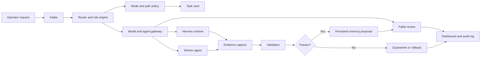
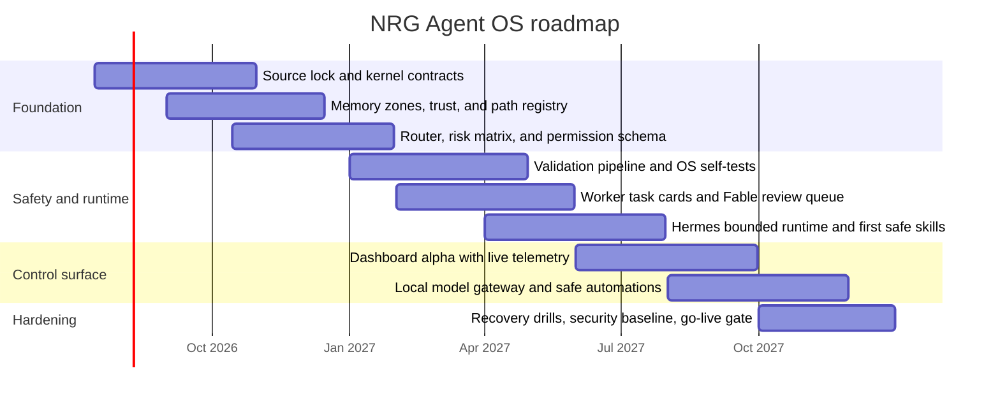

# NRG Agent OS Dashboard Information Pack Assessment

## Executive summary

The uploaded pack is architecturally strong but operationally immature. Across the corpus, NRG Agent OS is consistently framed as a **model-agnostic, local-first control plane** that governs agents, models, memory, permissions, validation, automation, recovery, and dashboard visibility. It is explicitly **not** supposed to collapse into a Hermes-only system, a Fable-only system, a JARVIS clone, or a decorative dashboard. fileciteturn0file5 fileciteturn0file2

The stable consensus in the pack is clear. **Fable** should design the important system and act as the final review gate; **Hermes** should be the daily runtime/operator inside the OS; **worker agents** such as Codex, GPT 5.5, Gemini Pro 3.5, and local-model candidates should execute only bounded task cards; **memory** should be first-class and split into persistent, scratch, and quarantine zones; and **destructive actions** should be blocked by default until explicitly approved. fileciteturn0file3 fileciteturn0file5 fileciteturn0file1

The pack’s main weakness is packaging. It contains repeated prompt variants, overlapping “factory pack” drafts, behavioural-biopsy material, early orchestration scaffolds, and JARVIS-style prototype inspiration, all mixed together. The pack itself repeatedly warns that this creates **instruction collision, slop, and context drift**, and its strongest internal recommendation is to compress the live system into a **kernel**, a **reusable method skill**, and a **worker task-card template** rather than another giant “super prompt.” fileciteturn0file14 fileciteturn0file6 fileciteturn0file9

The most important hard truth is this: the materials provided here are predominantly **design and prompt artifacts**, not an executable product baseline. The pack repeatedly describes things that *must be created*—source-lock files, task-card schemas, router schemas, permission policies, self-tests, dashboard panels, automation registries, and review queues—which means the current maturity is closer to **architecture and governance definition** than to a finished system. fileciteturn0file5 fileciteturn0file1 fileciteturn0file14

Because the visible corpus does **not** reliably specify a current repository baseline, a confirmed implementation stack, quantified current skill levels, or a named production user group, this report treats those items as controlled inferences rather than facts. Where I recommend a stack or roadmap, I do so by aligning with the repeated design constraints in the pack—file-first truth, typed contracts, explicit validation, bounded workers, local-first privacy, and operator-grade visibility. fileciteturn0file8 fileciteturn0file9 fileciteturn0file5

The shortest defensible conclusion is: **you already have the right conceptual OS; what you do not yet have is the hardened, normalized, implementable version of it.** The right next move is not more ideation. It is to turn this pack into a source-locked foundation repository with enforceable contracts, a validation spine, a minimal live dashboard fed by real telemetry, and a small first-wave skill library. fileciteturn0file14 fileciteturn0file5

## Source pack distillation

The corpus repeatedly converges on one backbone: **source lock → kernel → memory → router → validation → worker task system → Hermes runtime → skills/automations → dashboard**. That ordering appears in the original log consolidation, in the design-principles pack, and in the NRG Agent OS overview, which is the most complete architectural document in the set. fileciteturn0file0 fileciteturn0file1 fileciteturn0file5

The component map below normalizes the pack into the parts that actually matter for implementation.

| Component | What the pack already defines | Dependency shape | Current maturity | Recommended immediate artifact |
| --- | --- | --- | --- | --- |
| Source lock | `PROJECT.md`, `CURRENT_STATE.md`, `DECISIONS.md`, `ISSUES.md`, `NEXT_ACTION.md`, and source summaries are repeatedly proposed as the first step. fileciteturn0file5 | Nothing else should proceed without it | Planned, not evidenced as completed | `00_KERNEL/` + `01_MEMORY/source-summaries/` |
| Kernel and operating modes | Boot sequence, task lifecycle, definition of done, readonly/dry-run/sandbox/approved-write/recovery modes, and completion standards are defined in multiple drafts. fileciteturn0file5 fileciteturn0file0 | Depends on source lock | Strong concept, no executable policy shown | `FABLE5_SYSTEM_KERNEL.md`, `OPERATING_MODES.md`, `COMPLETION_STANDARD.md` |
| Router and model gateway | Tiered routing is explicit: rules/regex first, smaller routing model next, strong model only when needed; router inputs/outputs are described in schema form. fileciteturn0file1 fileciteturn0file5 | Depends on modes, risk schema, path registry | Well-specified conceptually | `MODEL_ROUTING_DOCTRINE.md`, `router.schema.json`, `TASK_RISK_MATRIX.md` |
| Permission and path control | Default readonly, path verification, no destructive ops without approval, no claims without evidence, no secrets exposure. fileciteturn0file0 fileciteturn0file5 | Depends on source lock and role split | Strong policy language, no enforcement layer shown | `PERMISSIONS.md`, `path-allowlist.yaml`, `destructive-actions.yaml` |
| Memory architecture | Persistent, scratch, quarantine zones; trust levels; promotion rules; source summaries; staleness handling. fileciteturn0file5 fileciteturn0file4 | Depends on source lock, evidence schema, review gate | Strong conceptual design | `MEMORY_SCHEMA.md`, `LESSON_PROMOTION_RULES.md` |
| Worker task system | Purpose, allowed/forbidden files and commands, exact inputs/outputs, acceptance checks, evidence required, rollback notes, and forbidden decisions. fileciteturn0file5 | Depends on router, permissions, validation | Template exists in prose form | `WORKER_TASK_CARD.md`, `WORKER_CONTRACT.md` |
| Fable review gate | All worker outputs should return to Fable for accept/revise/reject/quarantine review. fileciteturn0file5 fileciteturn0file3 | Depends on worker results and evidence capture | Conceptual, no queue mechanism shown | `FABLE_REVIEW_QUEUE.md` + review API later |
| Hermes runtime | Hermes may execute approved skills, write logs, create summaries, and propose updates, but may not silently change core prompts, policy, hooks, crons, or trusted memory. fileciteturn0file3 fileciteturn0file2 | Depends on skills, router, permissions, memory policy | Role is clear | `HERMES_RUNTIME_POLICY.md` |
| Validation spine | Path proof, diff proof, claim proof, test evidence, drift detection, hallucination detection, secrets redaction, and self-tests are repeatedly called for. fileciteturn0file5 fileciteturn0file1 | Depends on router, permissions, evidence capture | Strong requirements, no runner shown | `VALIDATION_RULES.md`, `os-self-tests/` |
| Automation layer | Hooks, crons, schedulers, file watchers, disable switches, and approval gates are planned, but early automations are supposed to stay readonly or draft-only. fileciteturn0file1 fileciteturn0file5 | Depends on validation and permissions | Intentionally deferred | `AUTOMATION_REGISTRY.md`, `HOOK_POLICY.md`, `CRON_POLICY.md` |
| Dashboard/control surface | Panel set is thoroughly described: Task Reactor, Router Trace, Agent Bay, Memory Control, Skill Rack, Automation Rail, Validation Board, Fable Gate, File Touch Map, Recovery Console. fileciteturn0file5 | Depends on live telemetry from the backend truth | Over-specified relative to implementation maturity | Build after telemetry API exists |
| JARVIS-inspired experience layer | Voice, fly-to-source proof, note-grounded chat, source-visible answers, model hot-swap UX, and capture-to-memory are allowed as inspiration only, not architecture. fileciteturn0file4 fileciteturn0file15 | Depends on stable kernel and memory model | Prototype inspiration only | Park in `06_SOURCE_EVIDENCE/` until core is stable |
| Agent framework scaffolding | `.agent.md`, `AGENTS.md`, UI component agent, and data/API agent patterns appear as early orchestration scaffolds. fileciteturn0file11 | Depends on normalized contracts | Early scaffold, not authoritative | Reuse later as bounded implementation helpers |

Two source-derived facts matter more than anything else. First, the pack clearly implies a **resource efficiency constraint**: Fable is treated as an expensive, high-value planner whose output should be durable, while cheaper workers handle repeated execution. Second, the intended audience appears to be a **primary operator** plus bounded worker agents, with a UI that should eventually allow even less technical users to launch high-value automations through buttons instead of terminals. Both are important design constraints even though neither is quantified in hard business terms. fileciteturn0file2 fileciteturn0file1

The pack does not name a definitive implementation language, but it does expose concrete language and artifact clues: Python standard-library scripts are used in the JARVIS prototype pack; the architecture drafts repeatedly rely on Markdown, JSON, YAML, and JSON-like schemas; and the early dashboard scaffolding assumes frontend component work and API integration. That makes a **Python control-plane + TypeScript cockpit** the cleanest inferred reference stack, even though it is still an inference rather than a discovered fact. fileciteturn0file15 fileciteturn0file1 fileciteturn0file11

## Target architecture, modules, flows, and access controls

The architecture that best fits the pack is a **file-first control plane** with a typed API layer, a bounded runtime layer, a validation spine, and a dashboard that only visualizes **real operational truth**. The pack is explicit that the cockpit must not be built first, and that failures must be made visible rather than buried under “generic glowing brains” or “memory galaxy clones.” fileciteturn0file5 fileciteturn0file4



This flow is synthesized directly from the pack’s task lifecycle, boot sequence, router schema, memory promotion rules, and review-gate logic. The key architectural move is that **memory promotion and acceptance are downstream of evidence and review, not upstream of execution**. fileciteturn0file5 fileciteturn0file3

My recommended reference implementation is:

- **Authoritative human-readable artifacts:** Markdown, JSON, and YAML for kernel rules, task cards, memory entries, and registries, because the pack repeatedly assumes agent-readable file artifacts as the durable source of truth. fileciteturn0file1 fileciteturn0file5
- **API contracts:** OpenAPI plus JSON Schema, because the OpenAPI Specification defines a language-agnostic interface description for HTTP APIs, and JSON Schema provides a standard vocabulary for annotating and validating JSON documents. That fits the pack’s constant demand for router schemas, evidence schemas, task-card schemas, and memory trust structures. fileciteturn0file5 citeturn3view8turn3view9
- **Backend/control plane:** FastAPI with Pydantic as the default implementation path, because FastAPI’s official tutorial is built as a step-by-step path to a complete application with tested code blocks and built-in docs, while Pydantic provides type-hint-driven validation and can emit JSON Schema. That combination is a strong fit for validation-heavy control-plane work. citeturn5view0turn8view2
- **Frontend cockpit:** React plus TypeScript, because the pack wants a panelized, component-based dashboard with explicit states, and React’s official docs center the UI around components while TypeScript’s handbook positions it as a static typechecker for JavaScript programs. fileciteturn0file5 citeturn3view0turn1view0
- **Observability and ops:** OpenTelemetry for traces, metrics, and logs, because the pack repeatedly demands event logs, audit trails, validation history, and inspectability, and OpenTelemetry is documented as a vendor-neutral open-source observability framework for traces, metrics, and logs. fileciteturn0file5 citeturn3view5
- **Durable state beyond flat files:** PostgreSQL later, not first, because the pack begins file-first but will eventually need stronger operational state for approvals, task history, and audits; PostgreSQL’s current documentation covers roles, monitoring, backup/restore, and reliability mechanisms such as WAL. That makes it a sensible Phase 2.5 or Phase 3 persistence step once the file contracts are stable. This is an inference, not a directly specified requirement. fileciteturn0file1 citeturn5view2

The access-control model should normalize the role split the pack already defines.

| Role | Read source state | Execute approved skills | Write scratch memory | Promote persistent memory | Change architecture or policy | Modify hooks/crons | Approve file writes | Final acceptance power |
| --- | --- | --- | --- | --- | --- | --- | --- | --- |
| Operator | Yes | Yes, by trigger | Yes, through UI/API | Yes, with explicit confirmation | Yes | Yes | Yes | Yes |
| Fable architect | Yes | Yes, sparingly | Yes | Yes, after review | Yes | Yes, by policy review | Yes | Yes |
| Hermes runtime | Yes | Yes | Yes | No, propose only | No | No | Only if pre-approved mode allows | No |
| Worker agents | Bounded context only | Yes, by task card only | Temporary only | No | No | No | Only within exact task card and mode | No |
| Scheduled automation | Bounded context only | Yes, if registered | Limited | No | No | N/A | Start readonly or draft-only | No |

That matrix is not a new invention. It is a direct operational cleanup of the role split and safety rules already present in the handoff, overview, and workflow documents. fileciteturn0file3 fileciteturn0file5 fileciteturn0file6

## Gap analysis and risk priorities

The table below compares the planned system against the evidence actually present in the pack. The priorities are based on implementation risk, not on how interesting a feature sounds.

| Priority | Gap | Why it matters | Evidence | Action |
| --- | --- | --- | --- | --- |
| P0 | No verified source-locked implementation baseline | Without a clean `PROJECT/CURRENT_STATE/PATHS/RULES` baseline, every later task risks invented paths, stale context, and false claims | Phase 0 is repeatedly described as still needing to be created. fileciteturn0file5 fileciteturn0file1 | Build `00_KERNEL/` and `01_MEMORY/PATHS.md` before any real coding |
| P0 | No executable permission engine or path allowlist | The pack’s strongest rule is readonly-by-default with verified paths; right now that is policy text, not enforced control | Destructive actions are blocked in prose, but no live enforcement artifact is shown. fileciteturn0file0 fileciteturn0file5 | Implement mode policy + allowlist + forbidden-action registry immediately |
| P0 | No validation runner or evidence pipeline | “No fake done” is central to the whole pack; without tests, diffs, and evidence capture, the OS loses credibility fast | Validation is detailed repeatedly, but only as planned structure. fileciteturn0file1 fileciteturn0file5 | Build a minimal write-task pipeline: diff capture, path check, test hook, evidence record |
| P1 | No normalized worker-task-card workflow in code | The pack depends on workers being bounded; without automation around task cards, cheap models will freestyle | Worker task-card template exists only as document text. fileciteturn0file5 | Create Markdown template + JSON schema + review queue integration |
| P1 | Memory policy exists only on paper | Persistent/scratch/quarantine logic is one of the best parts of the pack, but it does not protect anything until encoded | Memory classes, trust levels, and promotion logic are specified, not implemented. fileciteturn0file5 fileciteturn0file4 | Encode memory entries, trust tags, and promotion workflow as real objects/files |
| P1 | Dashboard design is ahead of backend truth | The panel system is well imagined, but a dashboard fed by mock data would violate the pack’s own ethos | The pack itself warns against building the HUD first and against “pretty fake UI.” fileciteturn0file5 fileciteturn0file14 | Start with operator console pages fed only by live task/event data |
| P1 | JARVIS inspiration can still distort scope | Voice, source-dive visuals, and galaxy metaphors are useful later, but dangerous if they hijack architecture now | JARVIS is repeatedly labeled prototype inspiration only. fileciteturn0file4 fileciteturn0file15 | Lock JARVIS ideas into an “inspiration layer” and defer until backend truth exists |
| P1 | No formal ingestion protocol for future source-pack updates | The workflow failure documented in the corpus came from mixing intake and processing too early | WAIT MODE → PROCESS NOW is documented as the corrective pattern. fileciteturn0file6 fileciteturn0file8 | Add a standard “source-ingest SOP” and enforce it for future large updates |
| P2 | No confirmed persona or use-case segmentation | Panel design, alerts, and automation maturity depend on who will operate the system day to day | Audience is implied but not concretely profiled in the visible corpus. fileciteturn0file1 fileciteturn0file8 | Define primary operator persona, secondary observer persona, and worker personas |
| P2 | No finalized stack decision | The pack is stack-aware but not stack-committed, which can stall implementation | Multiple artifact styles appear, but no definitive build stack is locked. fileciteturn0file1 fileciteturn0file11 fileciteturn0file15 | Approve one reference stack for the MVP and document why |
| P2 | Security is principled but not operationalized | Secrets safety, approval gates, and least-destructive handling are stated, but not translated into controls, checklists, or tests | API key handling and secret redaction are stated as rules. fileciteturn0file4 fileciteturn0file15 | Add secret scanning, env-file policy, approval logs, and restore drills |
| P2 | No maintenance cadence or ownership map | Without routine review, quarantine grows, policies drift, and disabled automations quietly rot | Review gates and logs exist conceptually, but no cadence is defined. fileciteturn0file5 fileciteturn0file14 | Add daily/weekly/monthly operating rhythm and named owners |

The core pattern in that table is simple: **your design risk is not lack of ideas; it is lack of operational compression.** The pack already knows this about itself. fileciteturn0file14 fileciteturn0file6

## Roadmap, milestones, KPIs, and maintenance

Because the time horizon is not explicitly fixed in the source pack, I recommend an **18-month plan** as the midpoint between the user’s requested 12–24 month range. That duration matches the pack’s clear long-horizon intent while still forcing discipline. The sequencing below follows the build order that the pack itself prescribes. fileciteturn0file2 fileciteturn0file5



The milestone logic is deliberately hostile to premature polish. The first deliverable is not a cinematic dashboard. It is a trustworthy kernel. After that, the gating rule is: **no major runtime freedom before permissions and validation exist; no major UI work before live backend truth exists; no live automation before self-tests and rollback exist.** fileciteturn0file5 fileciteturn0file1

The most useful KPIs are the ones that measure whether the OS is becoming safer, more truthful, and more reusable:

| KPI | Target by end of roadmap | Why it matters |
| --- | --- | --- |
| Source-lock completeness | 100% of required kernel docs present and updated weekly | Stops context drift at the root |
| Path-registry coverage | 95% of active project paths verified and categorized | Supports path proof and scope control |
| Task-card coverage | 90% of non-trivial worker tasks run from a formal task card | Keeps cheap workers bounded |
| Validation coverage | 95% of write tasks produce diff + test/evidence record | Enforces “no fake done” |
| Memory-promotion integrity | 100% of persistent-memory promotions include source, trust, promoter, and rollback tag | Prevents memory poisoning |
| Review-gate compliance | 100% of architecture-affecting changes reviewed through Fable gate or human gate | Preserves OS contracts |
| Dashboard truthfulness | 100% of production dashboard panels fed from real event/task telemetry, not mock data | Keeps the cockpit honest |
| Recovery readiness | Quarterly restore drill pass rate above 90% | Proves rollback/recovery actually work |

Those KPIs follow directly from the pack’s repeated emphasis on path proof, evidence capture, memory trust, review gates, live telemetry, and recovery. For instrumentation and long-term observability, OpenTelemetry is a fit because it standardizes collection and export of traces, metrics, and logs. For secure development practice and verification rigor, OWASP ASVS and NIST SSDF provide the closest external baselines to the security and review discipline this pack wants. fileciteturn0file5 citeturn3view5turn3view6turn3view7

The maintenance plan should be routine and boring:

| Cadence | Minimum maintenance actions |
| --- | --- |
| Daily | Review failed tasks, quarantine unverified memory, verify dashboard panels are live-backed, update `NEXT_ACTION.md` |
| Weekly | Review task-card drift, approve or reject memory proposals, disable noisy automations, inspect secrets and approval logs |
| Monthly | Archive stale issues, rotate operational checklists, test restore from backups/snapshots, review permissions and path allowlists |
| Quarterly | Run a recovery drill, review architecture debt, clean deprecated skills, refresh KPIs, and re-baseline the roadmap |

That cadence operationalizes the pack’s own logic around quarantine, disabled automations, recovery console, review gates, and secret redaction. fileciteturn0file5 fileciteturn0file14 fileciteturn0file15

## Learning curriculum and official resources

No reliable current skill baseline is defined in the visible source pack, so the curriculum below is staged from **least glamorous but most leverage-heavy** to more advanced topics. The sequence follows the same logic as the roadmap: contracts and validation before UI polish, and operational truth before automation. fileciteturn0file9 fileciteturn0file5

| Learning pathway | Why it is a priority for this OS | Best official sources | Expected artifact after study |
| --- | --- | --- | --- |
| Python control-plane fundamentals | The pack already gestures toward Python scripts and file-first automation; Python is the lowest-friction backend/runtime path for a solo or small-team control plane. fileciteturn0file15 | Python Tutorial. citeturn6view0 | A small CLI or service that reads/writes kernel and memory artifacts |
| Typed API design and validation | The pack is schema-heavy and policy-heavy; typed validation is central to task cards, memory entries, and router outputs. | FastAPI Tutorial; Pydantic docs; OpenAPI Specification; JSON Schema guide. citeturn5view0turn8view2turn3view8turn3view9 | A `router.schema.json`, `task-card.schema.json`, and a live `/tasks` API |
| Typed frontend cockpit | The cockpit is panel-heavy, state-heavy, and should make failures visible. Component discipline and static typing reduce dashboard slop. | React Learn; TypeScript Handbook. citeturn3view0turn1view0 | A minimal live dashboard with Task Reactor, Router Trace, and Validation Board |
| Verification and test automation | The pack’s non-negotiable rule is evidence-backed completion; you need both backend and UI verification. | pytest docs; Playwright docs. citeturn3view4turn3view3 | CI checks for path validation, API contracts, and UI flow smoke tests |
| Observability and event logging | The OS cannot function as a control plane without inspectability; logs, metrics, and traces are first-class in the pack. | OpenTelemetry docs. citeturn3view5 | Structured event/audit logs and basic telemetry dashboards |
| Secure development and approval gating | The pack insists on readonly defaults, explicit approvals, secret hygiene, and proof-oriented review. | OWASP ASVS; NIST SSDF. citeturn3view6turn3view7 | Security checklist, approval workflow, and release gate |
| Durable state and audit persistence | Flat files should start the OS, but approvals, task state, and long-running telemetry will eventually need a harder store. | PostgreSQL current docs; Docker get-started docs for reproducible local environments. citeturn5view2turn4view0 | PostgreSQL-backed task/event store and a containerized local dev setup |

The fastest **skill-development pathway** for this specific pack is therefore:

1. **Governance and contracts first**: task cards, source lock, permissions, review.
2. **Backend and validation second**: API contracts, schema validation, evidence capture.
3. **Dashboard third**: only once live telemetry exists.
4. **Automation fourth**: only once readonly and rollback are proven.
5. **Voice, knowledge-graph, and cinematic UX last**: only after the OS is boringly reliable. fileciteturn0file5 fileciteturn0file4 fileciteturn0file15

## Templates and example artifacts

The following examples are adapted from the pack’s own worker-task-card structure, memory trust model, router inputs/outputs, build-order discipline, and “command reactor” control-surface concept. They are deliberately plain because the sources repeatedly prefer **execution-shaping artifacts** over decorative prose. fileciteturn0file5 fileciteturn0file14 fileciteturn0file1

A quarterly OKR template that fits this OS:

```markdown
# Quarterly OKRs

## Objective
Make NRG Agent OS safe enough to run bounded worker tasks against real project files.

### Key Results
- KR1: Complete source lock pack and path registry for 100% of active project paths.
- KR2: Achieve 90% task-card coverage for all non-trivial worker tasks.
- KR3: Require diff + evidence records for 95% of write tasks.
- KR4: Launch dashboard alpha with three live-backed panels and zero mock telemetry in production mode.
- KR5: Pass one rollback drill from a documented failure scenario.

## Risks
- Missing repo truth
- Undefined stack decisions
- Overbuilding dashboard before validation exists

## Owner
Operator / Architect

## Review cadence
Weekly check-in, monthly KPI review, quarterly reset
```

A bounded-worker SOP that matches the pack’s safety posture:

```markdown
# SOP: Bounded Worker Execution

1. Confirm task ID, mode, risk, and assigned worker.
2. Read only the allowed context files and allowed paths.
3. Verify every claimed path before referencing it.
4. Do not touch forbidden files or forbidden commands.
5. Execute the smallest change that satisfies the task card.
6. Record:
   - what was checked
   - what was changed
   - what was not changed
   - evidence
   - risks
   - next safe step
7. Submit output to review.
8. Do not self-certify completion if validation has not run.
```

A minimal router-policy snippet for the MVP:

```yaml
version: 0.1

modes:
  - readonly
  - plan
  - dry_run
  - sandbox
  - approved_write
  - recovery

task_types:
  design:
    default_agent: fable
    allowed_modes: [readonly, plan]
    validations: [source_lock, scope_check]
  review:
    default_agent: fable
    allowed_modes: [readonly]
    validations: [path_check, evidence_check]
  runtime:
    default_agent: hermes
    allowed_modes: [readonly, dry_run, approved_write]
    validations: [path_check, policy_check]
  implement:
    default_agent: worker
    allowed_modes: [sandbox, approved_write]
    validations: [path_check, diff_check, test_check, evidence_check]

risk_rules:
  destructive_actions_require: explicit_operator_approval
  hook_or_cron_changes_require: fable_review
  memory_promotion_requires: evidence_or_user_confirmation
```

A compressed worker task-card template:

```markdown
# Worker Task Card

Task ID:
Task Name:
Assigned Worker:
Mode:
Risk Level:

## Purpose
## Allowed Files
## Forbidden Files
## Allowed Commands
## Forbidden Commands
## Exact Inputs
## Exact Outputs
## Acceptance Checks
## Evidence Required
## Rollback Notes
## What The Worker Must Not Decide
## Return Format
## Review Required
```

A memory-entry example that encodes the pack’s trust and promotion rules:

```json
{
  "memory_id": "MEM-2026-0001",
  "zone": "scratch",
  "trust_level": "agent-inferred",
  "subject": "router risk rule for hook edits",
  "claim": "Hook or cron changes require Fable review",
  "source_refs": ["source-pack-overview", "fable-handoff"],
  "evidence_refs": [],
  "proposed_by": "Hermes",
  "status": "pending_review",
  "can_promote_to": ["persistent"],
  "rollback_strategy": "mark_stale_or_quarantine"
}
```

The single most important example artifact, though, is not a code snippet. It is a repository shape that separates **live operating doctrine** from **source evidence**:

```text
NRG-Agent-OS/
├─ 00_KERNEL/
├─ 01_MEMORY/
├─ 02_ROUTER/
├─ 03_SKILLS/
├─ 04_TEMPLATES/
├─ 05_BUILD_START/
└─ 06_SOURCE_EVIDENCE/
```

That split is one of the sharpest ideas in the pack because it keeps the live kernel lean while preserving the larger prompt archive, behavioural biopsy, and inspiration material as evidence rather than authority. fileciteturn0file14 fileciteturn0file5